Nomenclature
=============

**QGIS**: Quantum Geographic Information System

**EPANET**: A software application for modeling water distribution
piping systems, developed by the United States Environmental Protection
Agency (US EPA)

**MSX**: EPANET‑MSX (Multi‑Species eXtension) is a specialized extension
to the EPANET hydraulic modeling engine that enables simulation of
multiple interacting chemicals within water distribution systems.

**DMA**: District Metered Area

**UI**: User Interface

**EPyT**: EPANET-Python Toolkit, a Python package for simulating water
networks using EPANET

**GIS**: Geographical Information System

**INP File**: Input file format used by EPANET for hydraulic model
simulations

**KIOS CoE**: KIOS Research & Innovation Center of Excellence

Introduction
============

This manual provides a comprehensive guide to the *dbpRisk 2.0* software
application, offering users clear instructions for accessing and
utilizing the tool’s functionalities.

The document begins with an overview of the IntoDBP project, followed by
step-by-step guidance on how to install the application and navigate the
user interface. Users are guided through configuring the mechanistic
model and using scenario builder and simulator. The document also
explains how to explore simulation results. It concludes with a
practical use case. This manual is designed to support both new and
experienced users in effectively applying *dbpRisk 2.0* for
decision-making and analysis.

IntoDBP is an EU-funded project that will develop, test, scale-up,
validate, and benchmark innovative tools and strategies to improve water
quality management for safe human use and a healthy environment. It
focuses on catchment protection and forecasting, transformative drinking
water treatment, and real-time monitoring to combat the effects of
climate and global change.

In particular, the project aims to develop a comprehensive approach from
source to tap for an optimum drinking water surveillance strategy, to
foster AI sensor deployment methodologies and algorithms in water
distribution networks (WDN) and create a new open and ready-to-use
workflow using a combination of dynamic and statistical models. In
addition, it aims to increase the understanding of human exposure, to
generate and implement models and recommendations to impact policy and
decision-making in Europe, as well as to provide guidance to decision
makers to formulate optimized and future-proofed climate change
adaptation pathways to successfully tackle emerging water quality
threats.

The project will develop its cross-cutting solutions on 4 complementary
case studies combining rural and dense urban areas, from 3 European
countries (Spain, Cyprus, and Ireland), where disinfection by-products
(DBPs) are a scientific, technological, and political challenge.

The consortium consists of 16 partners from Europe, including
researchers, small and large enterprises, communication experts, and
public services. On behalf of the University of Cyprus, NIREAS
International Water Research Center and KIOS Center of Excellence are
participating as project partners.

The KIOS research team contributes to the project’s outcomes by
implementing *dbpRisk 2.0* application, a mathematical and modelling
tool for the formation of DBPs, and for investigating strategies for
optimal control and minimization of their formation risk. This tool
represents a significant advancement in the field of water quality
management for safe human use.

To make effective use of the *dbpRisk 2.0* application, users are guided
through a series of structured steps. These are detailed in the
following sections of this manual and include:

1.  Installation: Set up the application and its dependencies.

2.  Selection of the hydraulic model: Choose a hydraulic model from the
    available options.

3.  Selection of the water quality/chemical reaction model: Define the
    water quality model based on MSX configuration.

4.  Mapping through GIS maps: Visualize the network on the map.

5.  Data fetching from Excel Files: Import sensor and sampling data
    locally.

6.  Data fetching from API: Retrieve data using credentials from remote
    sources.

7.  Data manager: Manage and organize input files via local or remote
    access.

8.  Calibrate and validate models: Use real measurements to refine model
    accuracy.

9.  Application of What-if Scenarios through a “Scenario builder” app:
    Define actions such as injections, initial concentrations, and
    parameter variations.

10. Scenario simulator: Run the scenario to simulate system response
    under selected conditions.

11. Model outputs through a “Results explorer” app: Visualize outputs
    through maps and plots for informed decision-making.

Installation Instructions
=========================

**dbpRisk 2.0** is a QGIS plugin developed to simulate the formation of
DBPs in WDNs. QGIS is a free and open-source GIS platform used worldwide
for creating, editing, and analyzing spatial data. It supports a wide
variety of formats and offers a flexible plugin architecture, making it
ideal for developing specialized tools like *dbpRisk 2.0*. By building
*dbpRisk 2.0* as a QGIS plugin, we enable users to integrate risk models
with geospatial data seamlessly, perform advanced spatial analyses, and
produce clear visual outputs - all within a single interface. To install
*dbpRisk 2.0*, users first need to **install QGIS from its official
website** `here <https://qgis.org/download/>`__.

After launching QGIS, the plugin can be added via the **Plugins > Manage
and Install Plugins** menu (**Figure 1**).

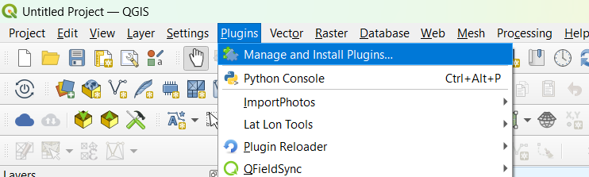
   

**Figure 1**: Installing the dbpRisk 2.0 plugin in QGIS

In the plugin manager window, search for *dbpRisk 2.0*, then select it
from the list and click **Install Plugin**, as shown in **Figure 2**.
Note that, from Plugins, you can install the open-source version of the
plugin.

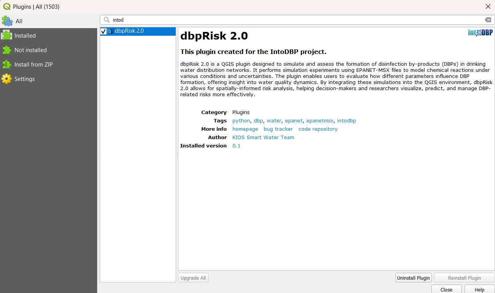
   

**Figure 2**: Select plugin and install

IntoDBP partners have the option of installing a version of the toolkit
that includes network models and data from the IntoDBP project. This can
be done using a .ZIP file which is shared privately among partners.
Partners should go to the **Install from ZIP** (**Figure 3**) option and
load the shared .ZIP file.

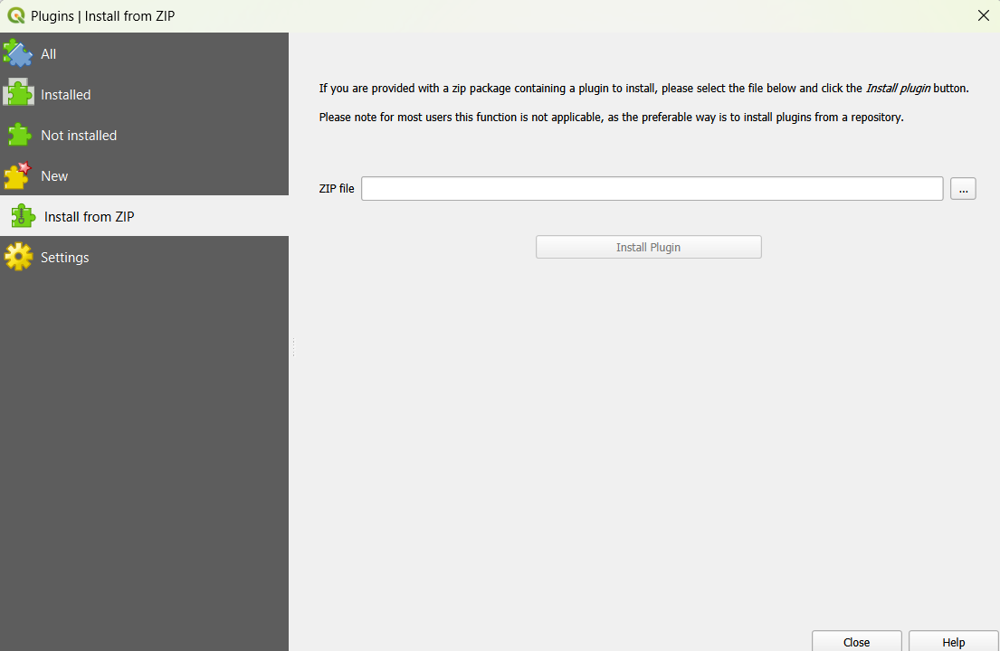
   

**Figure 3**: Installation of dbpRisk 2.0 in QGIS using a .ZIP file

Once installed, the plugin will appear in the QGIS interface and can be
accessed from the corresponding menu (Plugins) or from a toolbar in the
interface (Figure 4). Users can move the toolbars to customize the QGIS
user interface as desired.

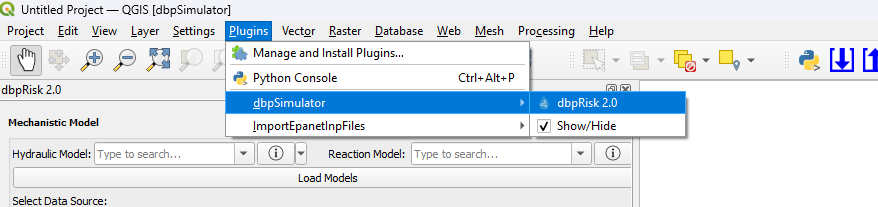
   

**Figure 4**: Loading the installed dbpRisk 2.0 plugin in QGIS

Operating system requirements
-----------------------------

Below you can find the operating system requirements for running QGIS
and the plugin:

**Minimum Requirements**

-  Operating System: Windows 10 (64-bit), macOS 10.14+, or a modern
   Linux distribution

-  Processor: Dual-core CPU (e.g., Intel Core i3 or AMD equivalent)

-  RAM: 8 GB

-  Storage: 10 GB available disk space for installation (additional
   space needed for data)

-  Graphics: OpenGL 3.2 compatible graphics card

-  Screen Resolution: 1366x768

**Recommended Requirements**

-  Operating System: Windows 11 (64-bit), macOS Monterey or later,
   Ubuntu 22.04+

-  Processor: Quad-core CPU (e.g., Intel Core i5/i7 or AMD Ryzen 5/7)

-  RAM: 16 GB or more (especially for large datasets or complex
   analysis)

-  Storage: SSD with at least 10 GB free space

-  Graphics: Dedicated GPU with at least 2 GB VRAM (NVIDIA/AMD)

-  Screen Resolution: 1920x1080 or higher

User interface
==============

The user interface of the *dbpRisk 2.0* application is presented in
**Figure 5**. This interface represents a fully integrated simulation
environment for modeling and analyzing water quality in a WDN, using
QGIS.

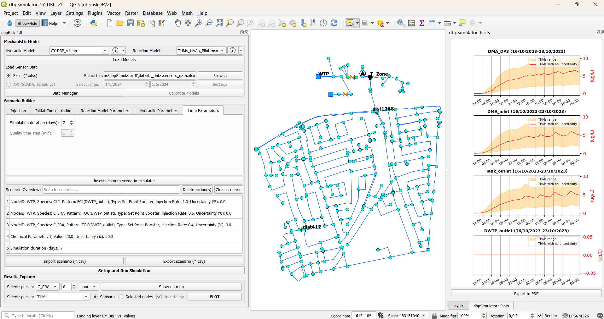
   

**Figure 5**: User interface

The menu bar (see **Figure 6**) contains standard QGIS options such as:
Project, Edit, View, Layer, Settings, Plugins, Vector, Raster, Database,
Mesh, Processing, and Help. These menus provide access to essential GIS
functions including map management, layer operations, plugin
integration, and data processing.

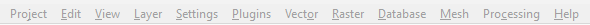
   

**Figure 6**: Menu bar

The toolbar (**Figure 7**) provides quick access to common tools and
actions, such as navigation tools (zoom, pan, select), layer controls,
attribute table viewer, map saving/exporting tools, plugin controls
including access to the custom *dbpRisk 2.0*.

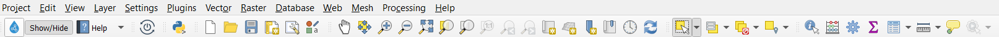
   

**Figure 7**: Toolbar

The custom *dbpRisk 2.0* plugin is organized into the following sections
(**Figure 8**):

-  Mechanistic model

-  Scenario builder

-  Setup and Run Simulation

-  Results explorer

The map view displays the WDN overlaid on a geographic map, with nodes
and links clearly visualized. The plot panel presents time series plots
of simulated values for selected species at sensor locations and
selected nodes.

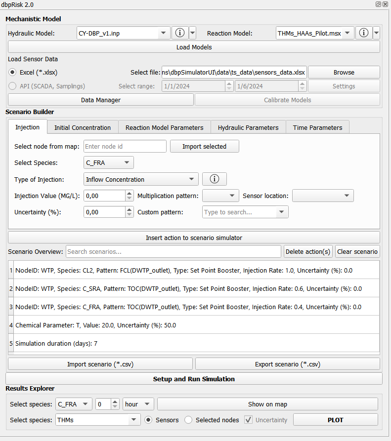
   

**Figure 8**: Main interface

Mechanistic model
-----------------

The mechanistic model configuration interface, shown in **Figure 9**
includes:

-  Selection of hydraulic and reaction models

-  Button to load models onto the map

-  Option to choose data source (excel or API)

-  File browser to select excel data file

-  Data manager access

-  Model calibration button (currently disabled)

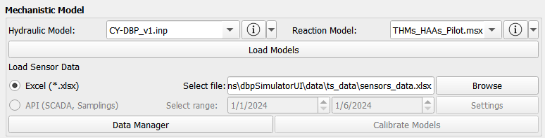
   

**Figure 9**: Mechanistic model configuration interface

Select hydraulic model
~~~~~~~~~~~~~~~~~~~~~~

Initially, the user can select a hydraulic model (EPANET file) from a
dropdown list or by selecting the option **IMPORT FILE**, you can import
your own EPANET input file (**Figure 10**).

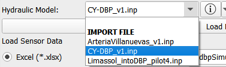
   

**Figure 10**: Select hydraulic model

By clicking the corresponding information button (**Figure 11**),
detailed information about the selected model can be accessed, as shown
in **Figure 12**. Additionally, the user can open the model on the
EPANET GUI (**Figure 13**) or in a notepad.

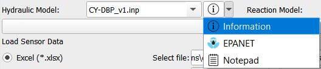
   

**Figure 11**: Hydraulic model Information, EPANET, Notepad buttons

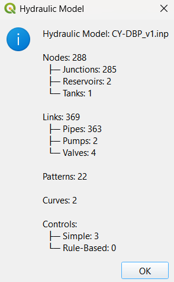
   

**Figure 12**: Hydraulic model information

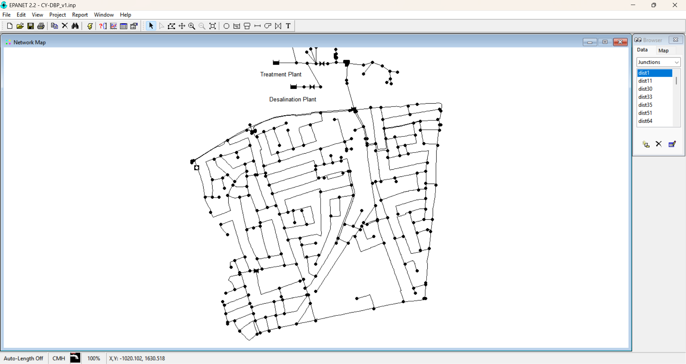
   

**Figure 13**: View network in EPANET

Select reaction model
~~~~~~~~~~~~~~~~~~~~~

After that, the user can select a reaction model (MSX file) from a
dropdown list (**Figure 14**).

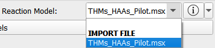
   

**Figure 14**: Select reaction model

By clicking the corresponding information button (**Figure 15**), the
selected MSX file is opened, allowing the user to view the detailed
configuration of the reaction model, as shown in **Figure 16**. Users
can also prepare their own MSX files by following the same structure as
the provided using the option **IMPORT FILE**.

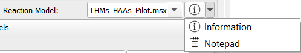
   

**Figure 15**: Reaction model Information and Notepad buttons

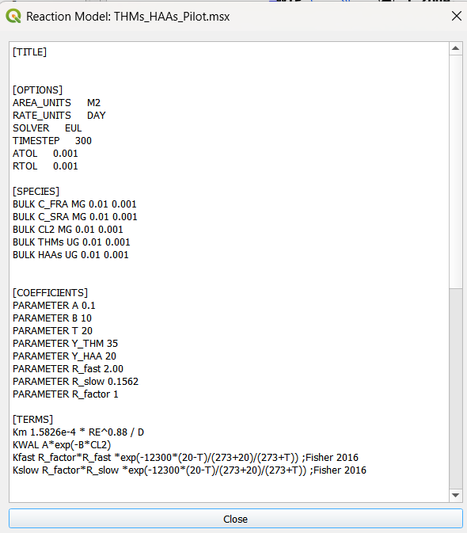
   

**Figure 16**: Selected MSX file

Load GIS on map
~~~~~~~~~~~~~~~

After selecting the hydraulic and reaction models, the user can load the
associated GIS data onto the map by clicking the ‘Load Models’ button
(**Figure 17**).

   

**Figure** **17**: Load models

The corresponding network elements then appear on the map for
visualization and interaction, as shown in **Figure 18**.

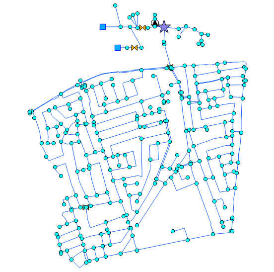
   

**Figure 18**:  Map view displaying the loaded GIS data

Fetch data from excel files
~~~~~~~~~~~~~~~~~~~~~~~~~~~

The user can select an excel file containing sensor data (e.g.,
conductivity, FCL, temperature, pH, etc.) for further processing, as
shown in **Figure 19**.

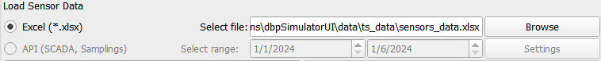
   

**Figure 19**: Load sensor data

Fetch data from API
~~~~~~~~~~~~~~~~~~~

Alternatively, data can be retrieved from the API by providing valid
user credentials (username and password). If the API option is selected,
the user can also specify the desired data period for retrieval
(**Figure 20**). This option is currently not available but is planned
for implementation in a future version.

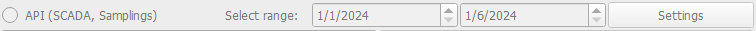
   

**Figure 20**: Select API

Data manager
~~~~~~~~~~~~

By clicking the ‘Data Manager’ button (**Figure 21**) the user can
search for specific data files, either by selecting excel files locally
or - once available - by providing a URL (e.g., from Zenodo) for remote
data access. The latter option is currently not available but is planned
for implementation in a future version.

   

**Figure 21**: Data manager button

Calibrate and validate models
~~~~~~~~~~~~~~~~~~~~~~~~~~~~~

The hydraulic and water quality models can be calibrated and validated
using real-world measurements obtained from field sensors and sampling
results, by clicking the ‘Calibrate Models’ button (**Figure 22**).
These data can be imported via excel files or retrieved through APIs for
calibrating models. This option is currently not available but is
planned for implementation in a future version.

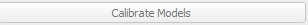
   

**Figure 22**: Model calibration button

Scenario builder
----------------

**Figure 23** shows the scenario builder interface, which supports the
following actions:

1. Injection

2. Initial Concentration

3. Reaction Model Parameters

4. Hydraulic Parameters

5. Time Parameters

The developed software enables users to simulate what-if scenarios
including various conditions, uncertainties and considering climate
change to assist in the decision-making process.

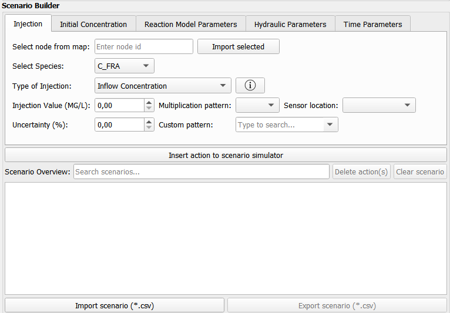

   

**Figure 23**: Scenario builder interface

Injection
~~~~~~~~~

Injection action include a node ID, available species (based on the MSX
file), the type of injection, an injection value and its uncertainty, as
shown in **Figure 24.**

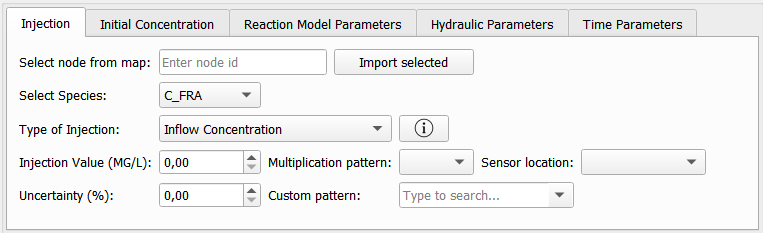

   

**Figure 24**: Injection parameters

The user can select a node directly from the map and by clicking ‘Import
selected’ button the corresponding node ID is captured and defined for
use in scenario builder.

Supported injection types include inflow concentration, mass inflow
booster, set point booster and flow paced booster (**Figure 25**). More
details for each injection type can be found in the EPANET manual.

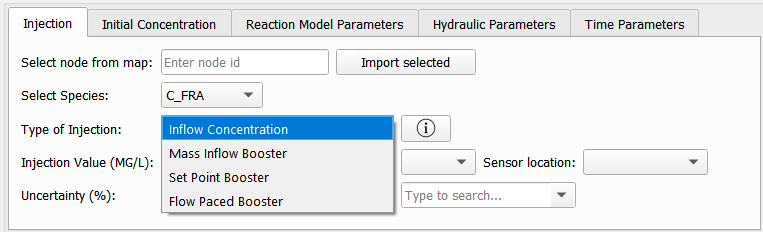

   

**Figure 25**: Injection types

Initial concentration
~~~~~~~~~~~~~~~~~~~~~

Initial concentration action includes the node ID, available species
(based on the MSX file) and an initial concentration value and its
uncertainty, as shown in **Figure 26**.

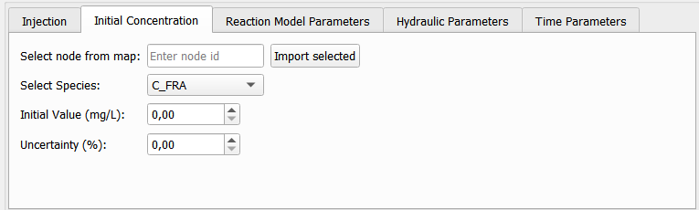

   

**Figure 26:** Initial concentration parameters

The user can select a node directly from the map and by clicking ‘Import
selected’ button the corresponding node ID is captured and defined for
use in scenario builder.

Reaction model parameters
~~~~~~~~~~~~~~~~~~~~~~~~~

Reaction model parameters’ actions include parameters based on the MSX
file, their values and uncertainty, as shown in **Figure 27**.

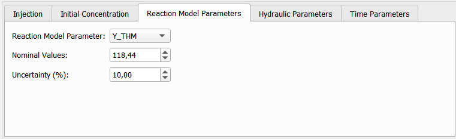

   

**Figure 27**: Reaction model parameters

Hydraulic parameters
~~~~~~~~~~~~~~~~~~~~

Hydraulic parameters scenarios include demand uncertainty, as shown in
**Figure 28**. A number of Monte Carlo simulations can be also defined
by the user.

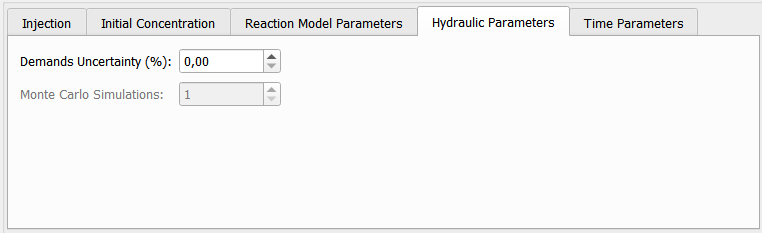
   

**Figure 28**: Hydraulic parameters

Time parameters
~~~~~~~~~~~~~~~

In this tab, users can set the simulation duration (e.g. 7 days)
(**Figure 29**).

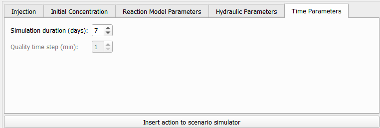

   

**Figure 29:** Time parameters

Insert action into the scenario simulator
~~~~~~~~~~~~~~~~~~~~~~~~~~~~~~~~~~~~~~~~~

The user can select the desired parameters of each type to build an
action and then insert the desired action to the scenario simulator box,
by clicking the ‘Insert action to scenario simulator’ button (**Figure
30**).

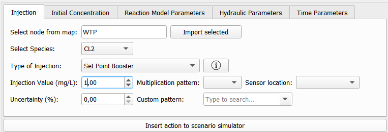

   

**Figure 30:** Insert action into scenario simulator

**Figure 31** shows the scenario overview which provides a list of all
configured actions. Users can manage actions using the ‘Delete action’
or ‘Clear scenario’ buttons, import/export scenarios, and search for any
word to display actions containing the searched word.

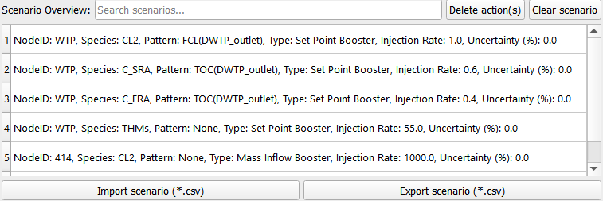

   

**Figure 31**: Scenario simulator interface

The user has the flexibility to manage the configured scenario by
removing individual actions or clearing all actions entirely. A specific
action can be deleted by clicking the ‘Delete action’ button (**Figure
32**), while the ‘Clear scenario’ button removes all actions from the
scenario simulator (**Figure 33**). A confirmation warning is displayed
before any deletion is finalized, ensuring that the user explicitly
confirms the removal of actions.

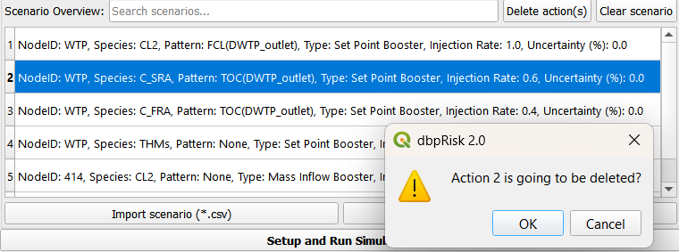

   

**Figure 32**: Delete action

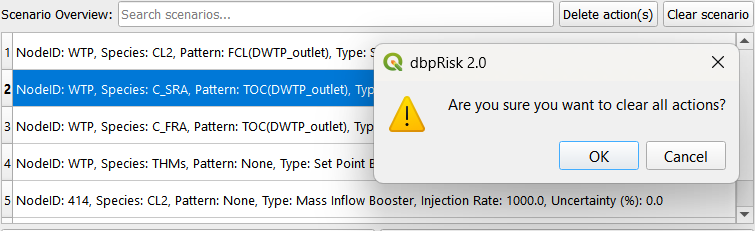

   

**Figure 33**: Clear scenario

Alternatively, a predefined scenario can be imported directly from a CSV
file by clicking the ‘Import scenario’ button (**Figure 34**), enabling
faster setup and reuse of previously configured scenarios.

   

**Figure 34**: Import scenario button

The user can also export the configured scenario as a CSV file by
clicking the ‘Export scenario’ button (**Figure 35**). This feature
supports scenario sharing and future reuse.

   

**Figure 35**: Export scenario button

Scenario simulator
------------------

In this section, once all desired actions have been added and retained
in the scenario simulator box, the user can simulate the what-if
scenario to support decision-making by clicking the ‘Setup and Run
Simulation’ button (**Figure 36**). In the time parameters, the user can
change the simulation duration and run it again without needing to add
it in the scenario overview.

   

**Figure 36**: Setup and Run Simulation button

Results explorer
----------------

**Figure 37** shows the results explorer interface, which allows users
to:

-  Select species

-  Choose a specific hour (the range depends on the defined simulation
   duration) to view data for a particular simulation time

-  Click the "Show on map" button to display the corresponding values on
   the map

-  Select one or two species to plot at either sensor locations or
   selected nodes

-  Use the "PLOT" button to generate visualizations

The "Include Samplings (API)" checkbox is currently disabled but is
planned for future implementation.

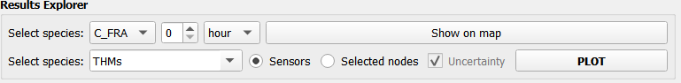
   

**Figure 37**: Results explorer interface

The user can select a species from a dropdown list (**Figure 38**),
choose the hour option (**Figure 39**) and specify a particular hour
from a dropdown list.

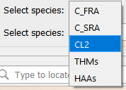

   

**Figure 38**: Select species

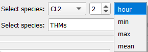

   

**Figure 39**: Choose hour option

By clicking the ‘Show on map’ button (**Figure 40**), the corresponding
simulated values can be visualized on the map for that specific time, as
shown in **Figure 41**. When hovering the mouse over a junction, the
species name and its simulated value are displayed.

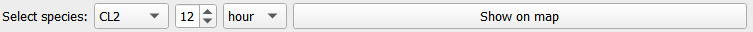
   

**Figure 40**: Show on map button

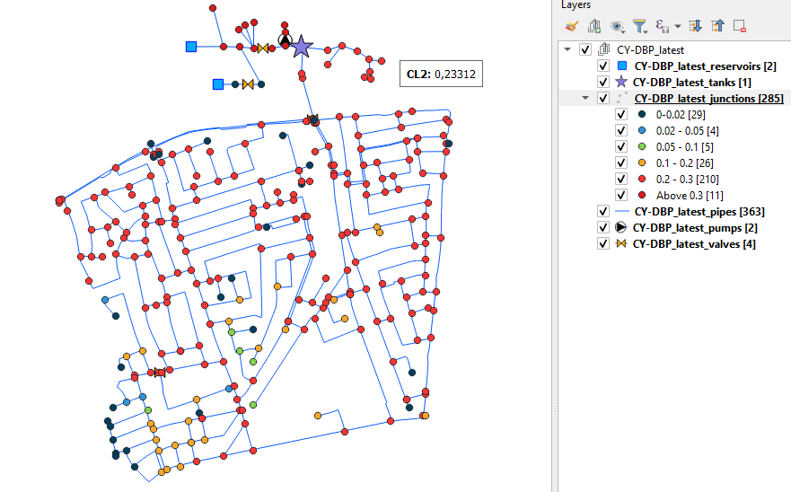

   

**Figure 41**: Simulated values on map

Additionally, the platform allows the display of the minimum, maximum
and mean values of these species over the simulation period, by
selecting the appropriate option from the dropdown list (**Figure 42**).

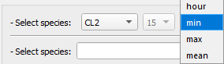

   

**Figure 42**: Show minimum values

The user can select one or two species (**Figure 43**), select Sensors
and by clicking the ‘PLOT’ button (**Figure 44**) the simulated species
at sensor locations can be visualized, as shown in **Figure 45**.

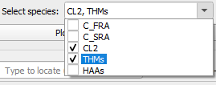

   

**Figure 43**: Select species

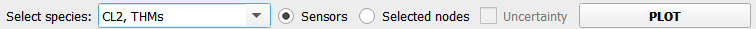
   

**Figure 44**: Plot species at sensor locations

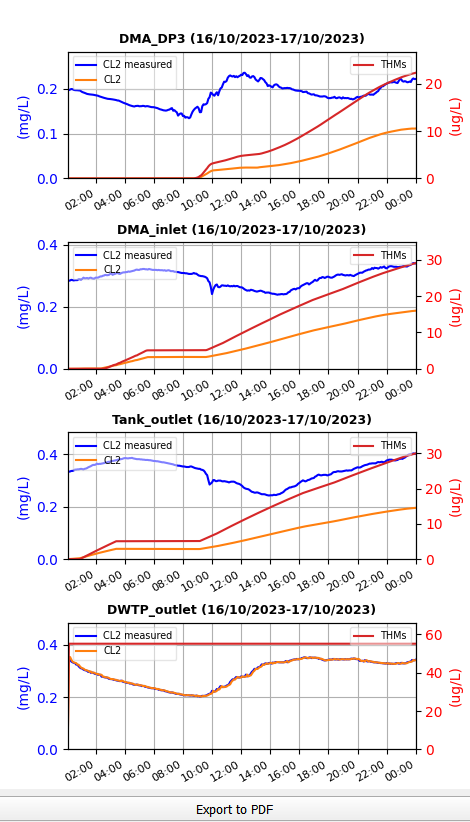
   

**Figure 45**: Plots of species at sensor locations

The user can also select nodes directly from the map, choose the
"Selected nodes" option and by clicking the ‘PLOT’ button (**Figure
46**) the simulated species at these nodes can be visualized, as shown
in **Figure 47**.

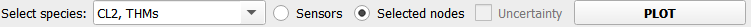
   

**Figure 46**: Plot species at selected nodes

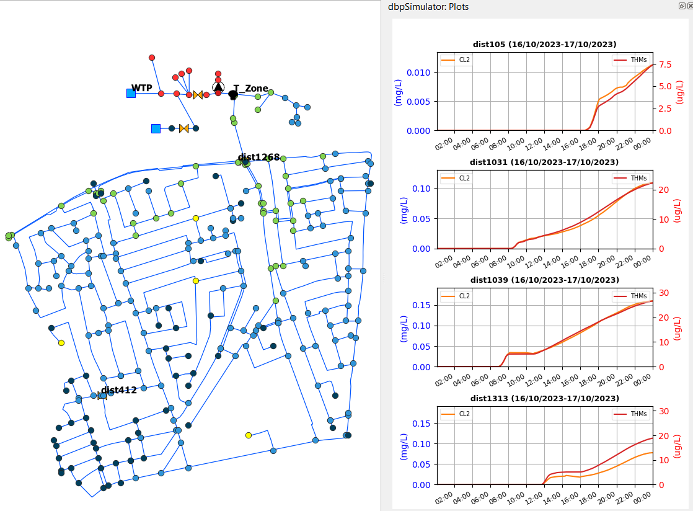

   

**Figure 47**: Plots of species at selected nodes

Use case
========

This section guides the user through a complete example of how to use
dbpRisk v2.0. It includes each major step, loading models and
configuring a scenario to simulating and visualizing results, offering a
hands-on demonstration of the tool in action.

First, select a hydraulic model from the dropdown list - e.g.,
CY-DBP_v1.inp (**Figure 48**).

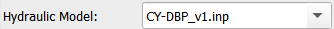
   

**Figure 48**: Select hydraulic model

Then, select a reaction model from the dropdown list - e.g.,
THMs_HAAs_Pilot.msx (**Figure 49**).

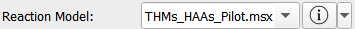
   

**Figure 49**: Select reaction model

After selecting the hydraulic and reaction models, load the associated
GIS data onto the map by clicking the ‘Load Models’ button (**Figure
50**).

   

**Figure 50**: Load models

The corresponding network elements then appear on the map for
visualization and interaction, as shown in **Figure 51**.

.. image::   ./media/image52.png

   

**Figure 51:**  Map view displaying the loaded GIS data

Select an excel file containing sensor data - e.g., sensors_data.xlsx
(**Figure 52**).

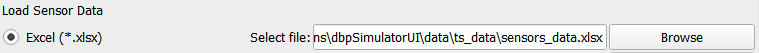
   

**Figure 52**: Load sensor data

Subsequently, configure the required parameters for each selected action
type. Once configured, insert the defined action into the Scenario
Overview by clicking the "Insert Action to Scenario Simulator" button.

**Scenario: Limassol Case Study**

We present the following scenario that considers chlorination at the
Water Treatment Plant (WTP) and rechlorination at the “Zone 2” Tank.
Chlorination at the WTP is represented by directly utilizing sensor data
at the outlet of the station, with TOC selected as the Reacting Agent
that represents Natural Organic Matter (NOM). The injected concentration
at each time step equals the defined “injection rate” multiplied by the
corresponding pattern value. If the loaded pattern represents the actual
concentration and not a pattern with multipliers, then the “injection
rate” should be set to 1.

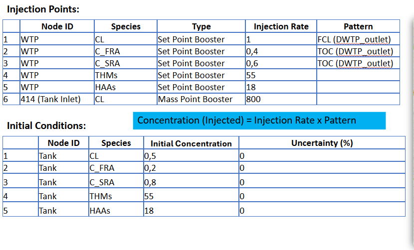
   

**Figure 53:** Disinfection scenario with chlorination at the Limassol
Case Study

Scenario actions were considered in the platform, as shown in the
figures below:

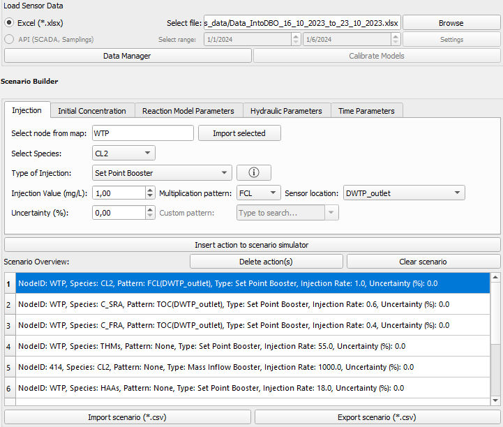
   

**Figure 54:** Defined actions (injected species) of the disinfection
scenario for the Limassol Case Study

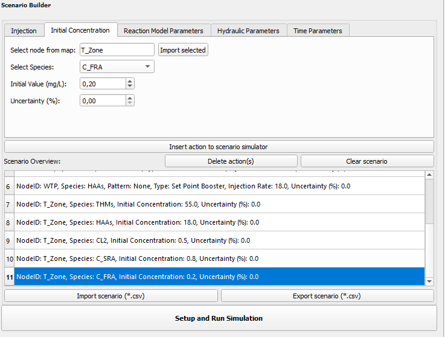

   

**Figure 55**: Defined initial conditions for the Limassol Case Study
scenario

Define the simulation duration in days (e.g., 7) as shown in **Figure
56**.

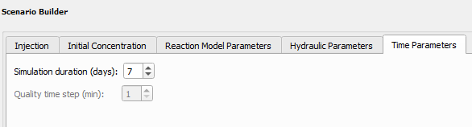
   

**Figure 56**: Select simulation duration

After adding all the desired actions to the Scenario Simulator and
specifying the simulation duration, initiate the simulation by clicking
the **"Setup and Run Simulation"** button. (**Figure 57**).

   

**Figure 57**: Setup and Run Simulation button

Once the simulation has been completed, select a species from the
dropdown list (e.g., CL2), choose the hour option and specify a
particular hour from the dropdown list (e.g., 165) as shown in **Figure
58**.

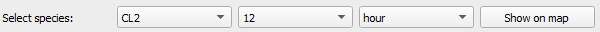
   

**Figure 58**: Select species and hour

By clicking the ‘Show on map’ button, the corresponding simulated values
are visualized on the map for that specific time, as shown in **Figure
59**.

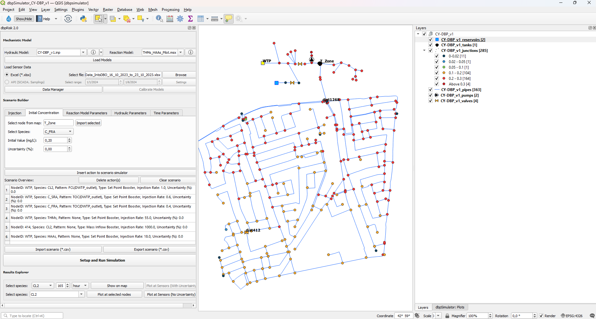

   

**Figure 59:** Simulated chlorine concentration values plotted on map
for a specific time

Additionally, the platform allows the display of the minimum, maximum
and mean values of the selected species (e.g. THMs) over the simulation
period, by selecting the appropriate option from the dropdown list –
e.g. max (**Figure 60**).

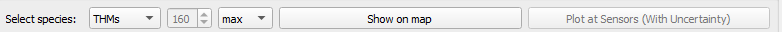
   

**Figure 60**: Select maximum values

By clicking the ‘Show on map’ button, the corresponding simulated values
are visualized on the map, as shown in **Figure 61**.

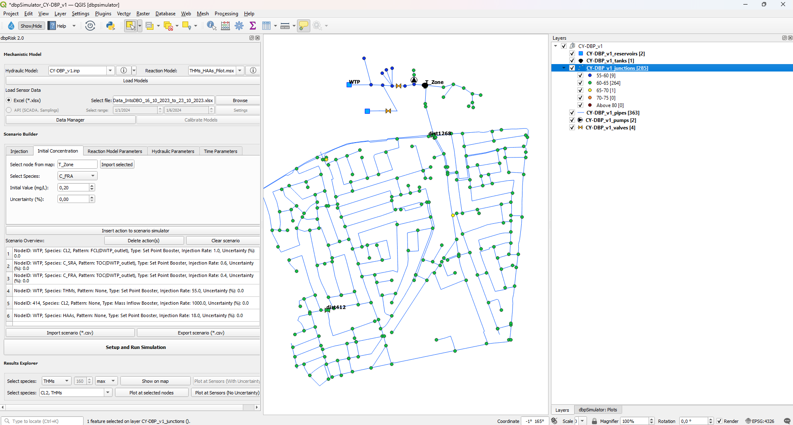

   

**Figure 61:** Simulated THMs max values on map

Select one or two species -e.g. CL2, THMs (**Figure 62**) and by
clicking the plot species at sensor locations (**Figure 63**) the
simulated species at sensor locations are visualized, as shown in
**Figure 64**.

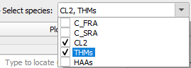

   

**Figure 62**: Select species

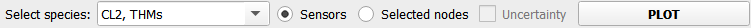
   

**Figure 63:** Plot species at sensor locations

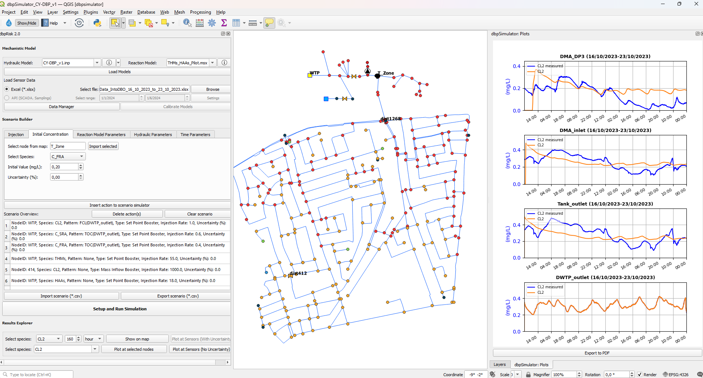

**Figure 64**: Plots of species at sensor locations compared to the
corresponding field sensor data

Further, by selecting random nodes directly from the map and by clicking
the plot species at selected nodes (**Figure 65**) the simulated species
at these nodes are visualized, as shown in **Figure 66**.

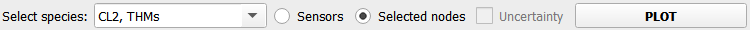

**Figure 65:** Plot species at selected nodes

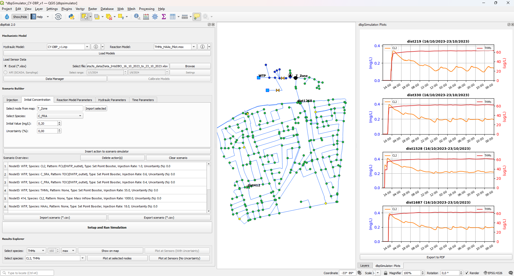

**Figure 66**: Plots of species at selected nodes

**Scenarios with uncertainties:**

The proposed tool provides the ability to consider uncertainties in all
model parameters. Currently, only one parameter with uncertainty can be
considered at a time, allowing the user to assess the model's
sensitivity to that specific parameter. Below is an example of two
scenarios involving parameter uncertainty, along with the corresponding
results. For each simulation, the maximum and minimum bounds for each
species are plotted, reflecting the range of variation resulting from
the considered parameter uncertainty.

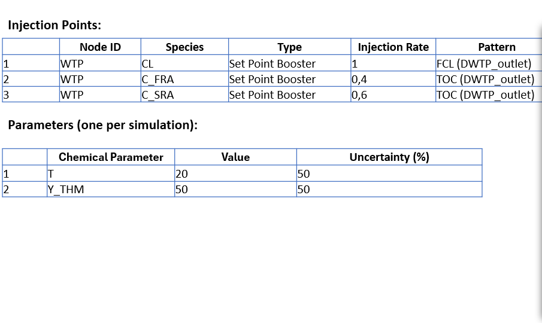

   

**Figure 67**: Disinfection scenario with uncertainties at the Limassol
Case Study

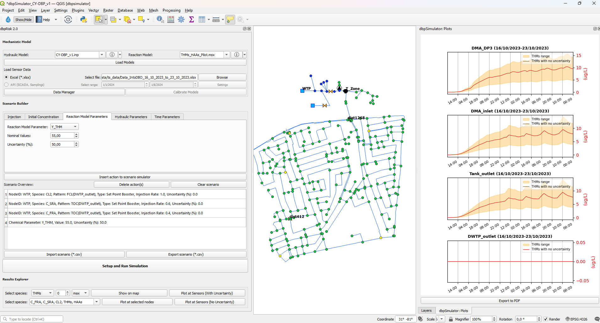

   

**Figure 68**: THMs concentration timeseries with uncertainty bounds
concerning the THM Yield coefficient

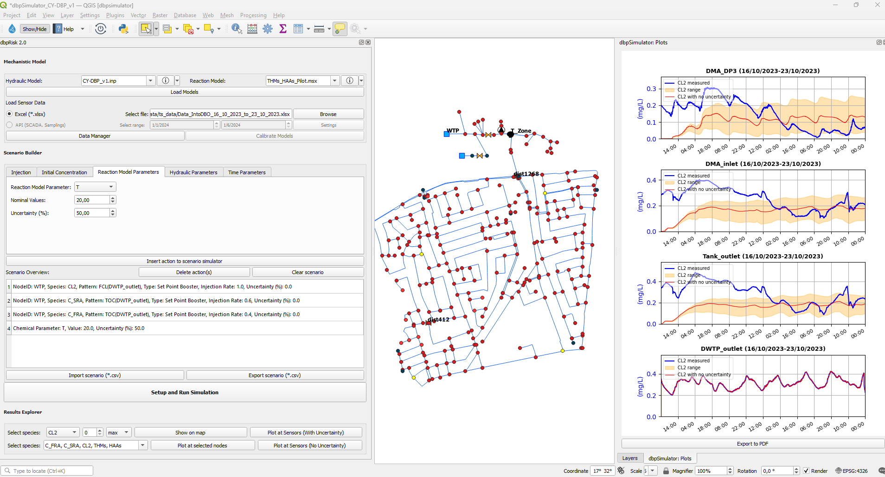
   

**Figure 69**: Chlorine concentration timeseries with uncertainty bounds
concerning the Temperature
